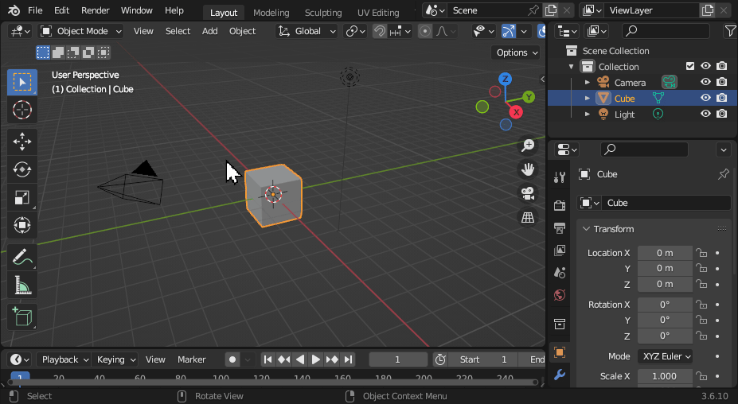
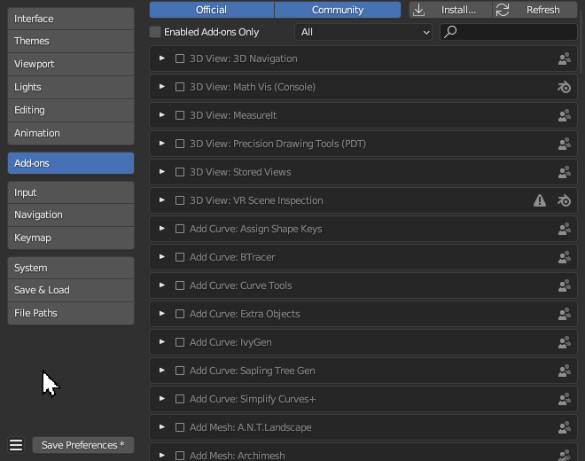
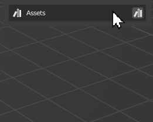
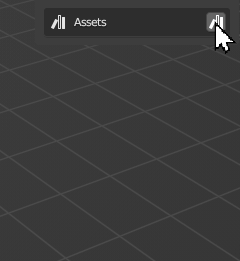
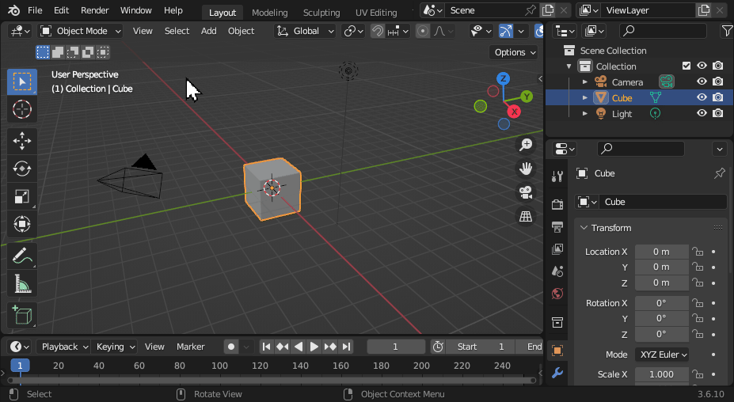
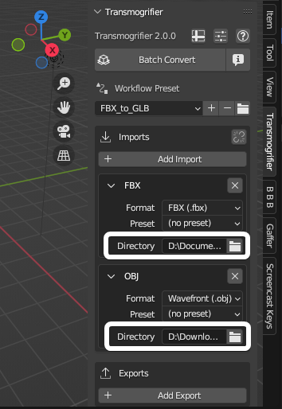

# Frequently Asked Questions

??? question "Do I have to import my first model into my Blender scene before Batch Converting?"
    #### "Do I have to import my first model into my Blender scene before Batch Converting?"

    No.  Transmogrifier imports and exports files via a new Blender session/window every time you batch convert, so your current scene doesn't need any preparation nor is it affected by the conversion.


??? question "What is Transmogrifier's license?"
    #### "What is Transmogrifier's license?"

    Transmogrifier is open-source/licensed-free software under the [GNU GPL](https://github.com/SapwoodStudio/Transmogrifier/blob/main/LICENSE).

    ??? Question "What is Free Software?"
        !!! quote ""
            ' “Free software” means software that respects users' freedom and community. Roughly, it means that the users have the freedom to run, copy, distribute, study, change and improve the software. Thus, “free software” is a matter of liberty, not price. To understand the concept, you should think of “free” as in “free speech,” not as in “free beer.” ' - [GNU.org](https://www.gnu.org/philosophy/free-sw.html)


??? question "Where is Transmogrifier installed on my computer?"
    #### "Where is Transmogrifier installed on my computer?"

    The location of Transmogrifier's files is dependent upon your operating system and your Blender installation.

    !!! tip 
        `X.XX` refers to your Blender version.  For example, `3.6`.

    !!! info "Transmogrifier's Location"
        === "GNU/Linux" 
            If you installed the add-on as a user:

            ```
            ~/.config/blender/X.XX/scripts/addons/Transmogrifier/
            ```

            If you installed the add-on system-wide: (1)
            {.annotate}
            
            1. This may also depend on your Linux distribution

            ```
            /usr/share/blender/X.XX/scripts/addons/Transmogrifier/
            ```

        === "Mac"
            If you installed the add-on as a user:

            ```
            /Users/{YOUR_USER}/Library/Application Support/Blender/X.XX/scripts/addons/Transmogrifier/
            ```

            If you installed the add-on system-wide:

            ```
            /Library/Application Support/Blender/X.XX/scripts/addons/Transmogrifier/
            ```

        === "Windows"
            On Windows:

            ```
            C:\Users\{YOUR_USER}\AppData\Roaming\Blender Foundation\X.XX\scripts\addons\Transmogrifier\
            ```

    !!! info "Transmogrifier [`Workflow Presets`](https://sapwoodstudio.github.io/Transmogrifier/features/#user-presets) Location"
        === "GNU/Linux" 
            If you installed the add-on as a user:

            ```
            ~/.config/blender/X.XX/scripts/presets/operator/transmogrifier
            ```

            If you installed the add-on system-wide: (1)
            {.annotate}
            
            1. This may also depend on your Linux distribution

            ```
            /usr/share/blender/X.XX/scripts/presets/operator/transmogrifier
            ```

        === "Mac"
            If you installed the add-on as a user:

            ```
            /Users/{YOUR_USER}/Library/Application Support/Blender/X.XX/scripts/presets/operator/transmogrifier
            ```

            If you installed the add-on system-wide:

            ```
            /Library/Application Support/Blender/X.XX/scripts/presets/operator/transmogrifier
            ```

        === "Windows"
            On Windows:

            ```
            C:\Users\{YOUR_USER}\AppData\Roaming\Blender Foundation\X.XX\scripts\presets\operator\transmogrifier
            ```


??? question "My [`Workflow Presets`](https://sapwoodstudio.github.io/Transmogrifier/features/#user-presets) don't work anymore."
    #### "My [`Workflow Presets`](https://sapwoodstudio.github.io/Transmogrifier/features/#user-presets) don't work anymore."

    Transmogrifier's codebase (API) was overhauled for version 2.0.0, so any `Workflow Presets` you made prior to this release won't work anymore.  Your import and export presets should still work, however.


??? question "Something's not working.  Where do I submit a bug report?"
    #### "Something's not working.  Where do I submit a bug report?"

    If Transmogrifier isn't working the way you expected, please let us know by submitting an issue on [Github](https://github.com/SapwoodStudio/Transmogrifier/issues) or reaching out on [BlenderArtists](https://blenderartists.org/t/transmogrifier-free-3d-batch-converter-addon/1475060).

    [Report Bug](https://github.com/SapwoodStudio/Transmogrifier/issues){ .md-button .md-button--primary }


??? question "How do I create an import or export preset?"
    #### "How do I create an import or export preset?"

    You can make your own import and export presets in the pop-up dialog box of the given format you are import or exporting.  

    !!! example
        For example, let's say you want to create a glTF export preset.

        1. Navigate to `File > Export` menu and click `glTF 2.0 (.glb/.gltf)`.
        
        2. Adjust your glTF export settings in the panel on the right.

        3. Now that you have made your adjustments to the export settings, click the `+` button to save them to a new preset. 
        
        4. Name your preset, then click `OK`.

        !!! success "Success! You have now created your own export preset."
            Import presets work the same way.

                    

    !!! note
        Blender doesn't support presets for some import and export formats.  We are unsure why!


??? question "How do I update Transmogrifier?"
    #### "How do I update Transmogrifier?"

    Check out the [Update 🔁](https://sapwoodstudio.github.io/Transmogrifier/update/) page.


??? question "How do I uninstall Transmogrifier?"
    #### "How do I uninstall Transmogrifier?"

    Check out the [Uninstall 🔌](https://sapwoodstudio.github.io/Transmogrifier/uninstall/) page.


??? question "How do I create an Asset Library?"
    #### "How do I create an Asset Library?"

    Open Blender, then navigate to `Edit > Preferences`.

    

    Then click `File Paths` and scroll down to the `Asset Libraries` section.
    

    !!! success
        Now you should see your new library availabe in your `Assets > Storage > Library` menu.

        

    !!! info
        For more information about Asset Libraries, check out Blender's [documentation](https://docs.blender.org/manual/en/latest/files/asset_libraries/index.html).


??? question "How do I create Asset Catalogs?"
    #### "How do I create Asset Catalogs?"

    This is less intuitive than creating an Asset Library.  

    1. Open a new Blender session.

    2. Split the view and change the panel to the `Asset Browser`.

    3. Select your desired asset library from the menu.

    4. Click the `+` button to add an `Asset Catalog`.  Add and rename as many asset catalogs and sub-catalogs as you wish.

    !!! warning
        Your changes to the `Asset Library`'s Catalogs are not saved yet.  Don't close Blender.

    5. Now save the current Blender session inside your `Asset Library` as something like `blender_assets.cats.blend`. 

    !!! tip
        The name of your Blender file doesn't matter.  We only suggest to save it with the title `blender_assets.cats.blend` for the sake of consistency, since Asset Catalogs are stored in a `.txt` file stored in your Asset Library directory as `blender_assets.cats.txt`.

    6. Now, whenever you want to add/edit/remove new catalogs, open `blender_assets.cats.blend`, make your changes, and save the file again.

    Here's a GIF that sums it all up.

    

    !!! success "You have now created Asset Catalogs."
        They should now be visible in Transmogrifier's `Assets > Storage > Library` menu.

        
        

???+ question "How do I make a `Custom Script` for Transmogrifier?"
    #### "How do I make a `Custom Script` for Transmogrifier?"

    Creating custom scripts is easy for developers and non-developer alike.  
    
    1. Open Blender and navigate to the `Scripting` tab.

    2. Click `+ New` in the Text Editor to create a new text data-block.

    3. If you know Python for Blender, you can write your script.  It doesn't have to be anything fancy.  Pythonic conventions, such as adding functions and commenting your code, are recommended but not required.  

        === "Basic"
            ``` py
            # Add_Monkey_and_Shade_Flat.py
            
            bpy.ops.object.select_all(action='DESELECT')
            bpy.ops.mesh.primitive_monkey_add(size=2, enter_editmode=False, align='WORLD', location=(0, 0, 0), scale=(0.01, 0.01, 0.01))
            bpy.ops.object.select_all(action='SELECT')
            bpy.ops.object.shade_flat()
            ```

        === "Better"
            ```py
            # Add_Monkey_and_Shade_Flat.py

            # Add a monkey to the scene.
            def add_monkey():
                bpy.ops.object.select_all(action='DESELECT')
                bpy.ops.mesh.primitive_monkey_add(size=2, enter_editmode=False, align='WORLD', location=(0, 0, 0), scale=(0.01, 0.01, 0.01))
                
            # Shade all objects with flat shading.
            def shade_flat():
                bpy.ops.object.select_all(action='SELECT')
                bpy.ops.object.shade_flat()

            # Add monkey and shade flat.
            add_monkey()
            shade_flat()

            ```
    

    4. Save your code as a Python (`.py`) file.

    !!! success "Success!"
        Now you can add your Python recipe as a custom script for Transmogrifier to execute during conversion.

    !!! tip "New to Python?"
        If you're new to Python programming, don't worry!  You can discover and copy many commands directly from the Blender's user interface.  

        For example, if you wanted to find the command for adding a Monkey to your scene, simply add the monkey graphically, open the `Info` panel, copy the monkey's Python command, and paste it into your script.

        


??? question "Where are log files output?"
    #### "Where are log files output?"

    Log files are stored inside the `Imports > Directory` (or in each of the `Directory` of each import box if you have multiple imports whose settings are not linked).
    
    | When Import Settings are Linked | When Import Settings are Unlinked |
    | ---- | ---- |
    |  |  |


??? question "Why are there so many icon buttons without descriptions?"
    #### "Why are there so many icon buttons without descriptions?"

    Transmogrifier is a robust suite of tools for batch converting 3D files.  As we added more and more features, its user interface grew longer and longer.  So, we overhauled the UI in version 2.0.0 to make it more compact.  We replaced a lot of the prior checkboxes that had names with icon-only buttons and shoved them in the top-right of each relevant box, which made a lot of room for everything else.    