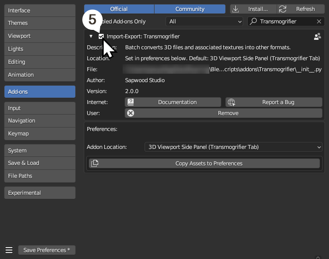
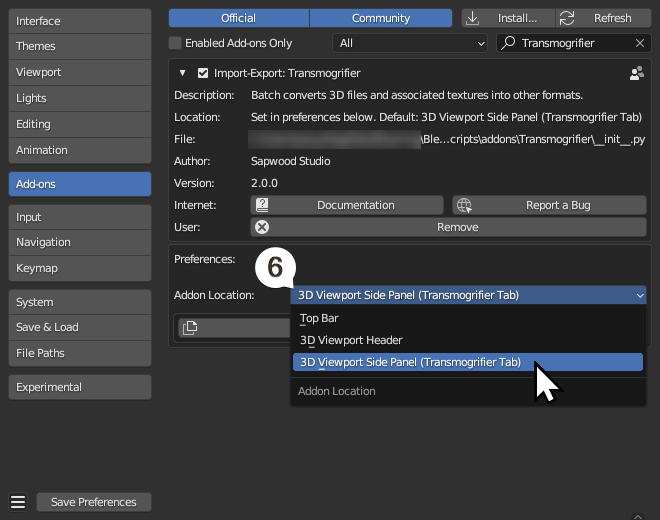

## Installation 📥

### 1. Download and install Blender
Blender is a cross-platform, licensed-free 3D content creation software, developed by people all over the world.  

[Download Blender 3.6 LTS](https://www.blender.org/download/lts/3-6/){ .md-button .md-button--primary }

??? question "Why LTS?"
    Transmogrifier is developed specifically for long-term support (LTS) versions of Blender.  These are branches of the software which receive optimizations and stability improvements over 2-year cycles.  We develop Transmogrifier for Blender LTS because it reduces our having to play "catch-up" with incremental changes to Blender's API, thus allowing us to focus more on developing add-on itself.  
    
    **Transmogrifier may work on non-LTS versions >3.6, but this is not guaranteed.**

<!-- 
!!! example "Operating Systems"
    Transmogrifier is developed on Windows & Ubuntu.  It ought to work just fine on MacOS, but this has not been tested. -->

### 2. Download the Transmogrifier Add-on 
The Transmogrifier add-on extends Blender with a 3D batch conversion toolset.

[Download Transmogrifier](https://github.com/SapwoodStudio/Transmogrifier/releases/latest/download/Transmogrifier.zip){ .md-button .md-button--primary }

!!! tip
    A good default place to save is your `Downloads` directory.  You do not need to unzip the file.  In the next step, you'll install it as a zipped file.

### 3. Install the Transmogrifier Add-on

1. Open Blender, then navigate to `Edit > Preferences`.

    

2. Select the `Add-ons` tab, and press `Install…` on the top right. Navigate to the .zip you downloaded in Step 2, and press `Install Add-on`.

    

    !!! warning
        You do not need to unzip the add-on file. You should install it as a zipped file.

3. You should now see `Import-Export: Transmogrifier` available in your add-ons list. Enable the add-on by clicking the checkbox.

    

### 4. Choose where to display Transmogrifier

Transmogrifier can be conveniently displayed in different places within Blender's user interface.

!!! tip "`Addon Location` Screenshots"
    | `Top Bar` | `3D Viewport Header` | `3D Viewport Side Panel` |
    | ------- | ------------------ | ---------------------- |
    |  |  |  |
    | Good location for Basic usage | Good location for Basic usage | Good location for Basic usage / Best location for Advanced usage |

### 5. Install example presets

Transmogrifier comes with some example presets for its own settings and for importing and exporting certain formats.  You may copy them to your user preferences by clicking `Install Example Presets`.

!!! tip
    This is highly recommended for beginners to Transmogrifier or for those who rely on these presets and desire to keep them updated with each new Transmogrifier version.

***
## Quickstart Demo 🧪
!!! quote ""
    *"The best way to teach kayaking is not by lecturing on the sand.  Instead, toss a bucket of tennis balls onto the lake and say, 'Go get 'em!'"*

Learn Transmogrifier with a demo!  This will quickstart your first steps using the addon.

=== "1. Download the Demo Files"
    ### 1. Download the Demo Files
    Download the demo files, then unzip the folder.  Inside you will find 3D models as FBX files along with their associated textures.

    [Download PolyHaven Demo Files](https://github.com/SapwoodStudio/Transmogrifier/releases/latest/download/PolyHaven_Demo_Files.zip){ .md-button .md-button--primary }

    !!! info "PolyHaven"
        [PolyHaven](https://polyhaven.com/) is a creative-commons (CC0) library of models, textures and HDRI's.  We've curated 5 models with textures from their library for this demo.

=== "2. `Add Import`" 
    ### 2. Add Import
    Click `+ Add Import` to add an import file format for Transmogrifier to search for.  Leave the format in its default value (`FBX`).

    

=== "3. Select `Directory`"
    ### 3. Select `Directory`
    Click on the folder icon at the bottom of the `Imports` box.  In the pop-up file dialog, double-click into the unzipped "PolyHaven_Demo_Files" folder and click `Accept`.

    

=== "4. `Add Export`"
    ### 4. Add Export
    Click `+ Add Export` to add an export file format for Transmogrifier to output for each import file it finds.  Leave the format in its default value (`GLB`).

    

=== "5. Check the `Forecast`"
    ### 5. Check the `Forecast`
    Click the `Forecast` button to predict the batch conversion.  In this case, Transmogrifier should find 5 `FBX` files in the PolyHaven_Demo_Files folder which will then be converted to 5 `GLB` files in the next step.
    
    

=== "6. Click `Batch Convert`"
    ### 6. Click `Batch Convert`
    Finally, click `Batch Convert` and let the process run.  When it finishes, you should now be able to find 5 `GLB` files, one in each model's folder.  

    !!! info
        After this button is clicked, a second Blender window will pop-up.  This window will be greyed-out, and both this and the original Blender window will remain unresponsive until the batch conversion is over.  This is normal operation. 

    

## User Interface

## General Usage 🏭

1. **Select a directory** containing 3D files of the chosen **import format**, or a parent directory of arbitrary organization and/or depth as long as there exists at least one 3D file of the specified import format somewhere inside.  Try out the [Demo](#demo-) 🧪 below to get started.

2. **Select an output directory** to which 3D files of the chosen **export format(s)** should be exported. "Adjacents" means that converted models will be saved to the same directories from which they were imported. "Custom" means that converted models will be saved to a chosen custom directory.

3. **Set additional export settings** as described in the [Features](#features-) section below. (_Optional: to save current settings for later use, save the current .blend file_)

4. **Click "Batch Convert"**. This will spawn another instance of Blender. The new Blender window will remain grey while the conversion process gets output to the console window. The original Blender window will remain frozen/unresponsive until the batch conversion is complete. This is normal operation. After the conversion finishes, the greyed-out Blender window will disappear and the original Blender instance will report how many files were converted.  If you wish to see the conversion process get logged in real-time, you must start Blender from your terminal/Command Line first before Transmogrifying.

(Ubuntu Example)

(Windows Example)

