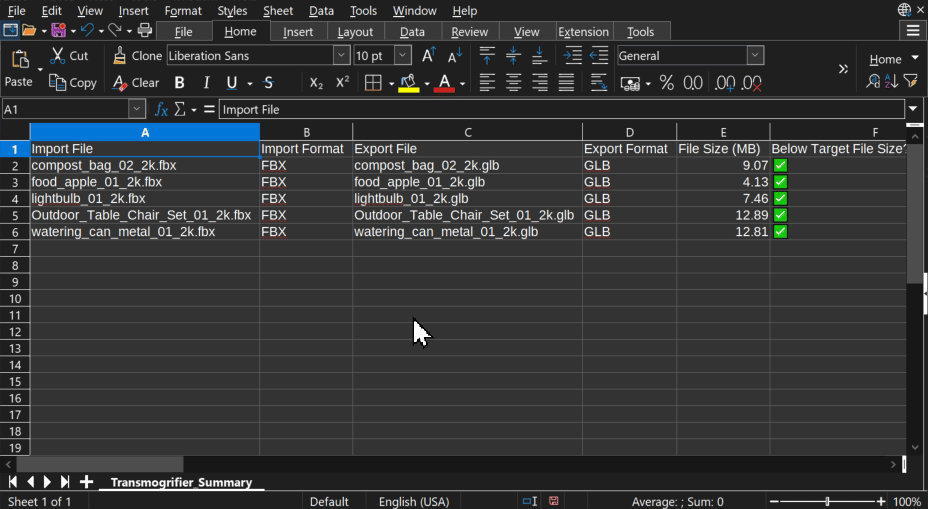

# Log Conversions
It can be difficult to verify the success of a batch conversion apart from individually combing through your converted files.  Logging your batch conversions allows you to review them with a batch approach as well.  The `Conversion Summary` and `Conversion Log` solve this tedious task.

## Conversion Summary
Save a  `Conversion Summary` as a `CSV` file of the batch conversion in the given import directories. The summary records statistics about each model converted.

### Statistics
The `Conversion Summary` allows you filter which statistics to document in the CSV output. (1) 
{ .annotate }

1. `Import File`, `Import Format`, `Export File`, and `Export Format` are always logged.

| Statistic  | Description                                                                        |
| ---------- | ---------------------------------------------------------------------------------- |
| `Date`       | The date and time at which each model is converted |
| `Import File` | The name of the import file with the file suffix |
| `Import Format` | The import file's 3D format abbreviation |
| `Export File` | The name of the export file with the file suffix |
| `Import Format` | The export file's 3D format abbreviation |
| `File Size`  | Exports' file sizes and comparison to the target threshold |
| `Dimensions` | Exports' dimensions and comparison with the target dimensions |
| `Objects`    | Object count and names in each exported model |
| `Polycount`  | Number of vertices, edges, faces, and triangles in each exported model |
| `Materials`  | Number and names of materials applied to each exported model |
| `Textures`   | Number and names of the textures applied to each exported model |
| `File Path`  | File path of each exported model |

#### Compare File Size
Compare each export file's filesize against the `Target` threshold. (1)
{ .annotate }

1. This setting is synchronized between the `Auto-Optimize Files` box and the `Logging` box.

- If `export file size` > `target file size`, then a `🔺` will be recorded.
- If `export file size` < `target file size`, then a `✅` will be recorded.

#### Compare Dimensions
Compare each export file's dimensions against a bounding box of dimensions you specify.

- If `export file dimensions` > `bounding box dimensions`, then a `🔺` will be recorded.
- If `export file dimensions` < `bounding box dimensions`, then a `✅` will be recorded.

## Conversion Log
Save a  `Conversion Log` of the batch conversion as a `TXT` file in the given import directories. The log records each step of the conversion process, which is invaluable for troubleshooting conversion errors and bugs.

!!! tip
    To quickly verify that no errors occured during the batch conversion, open the log file, `Ctrl + F` to search for a string of text, and type "`error`".  If no results are found, then Transmogrifier encountered no errors during the conversion process.

***
!!! question "Missing Something?"
    Do you think we're missing a feature?  Submit a request on Github!

    [Request Feature](https://github.com/SapwoodStudio/Transmogrifier/issues){ .md-button .md-button--primary }